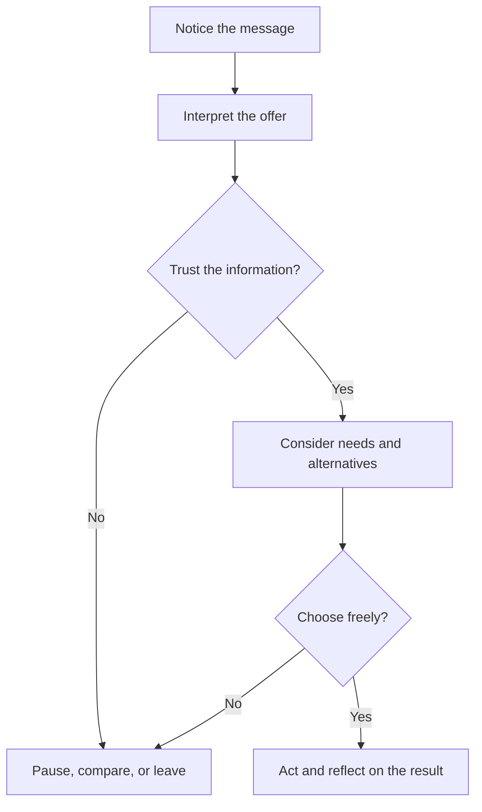

# Chapter 1: Persuasion and Human Decision-Making

Persuasion is the practice of shaping how people notice, interpret, trust, and act on information. It can happen through words, images, layout, timing, price, packaging, or the behavior of other people. A designer persuades whenever a design makes one interpretation or action easier to see than another.

Persuasion does not remove a person's ability to choose. At its best, it gives people useful reasons, makes relevant information easier to understand, and connects a product or idea to a real need. A sign that clearly explains where to recycle is persuasive. So is a product page that helps someone compare sizes before buying.

## Persuasion, Manipulation, and Coercion

These terms are related, but they are not interchangeable.

| Approach | How it works | What happens to the audience's choice |
| --- | --- | --- |
| Persuasion | Offers reasons, evidence, or meaningful associations | The person can understand the appeal and still decide freely |
| Manipulation | Hides important information or exploits a fear, bias, or vulnerability | The person is pushed toward a choice they might reject with a clearer picture |
| Coercion | Uses threats, force, or punishment | The person is denied a genuinely voluntary choice |

The boundary is not simply whether someone changes their mind. The important questions are whether the message is truthful, whether material information is visible, whether the audience can say no, and whether the designer is exploiting an unfair power difference.

Imagine a plain white T-shirt. Calling it a "100% cotton everyday shirt" may help a shopper understand its use. Calling it "the last shirt you will ever need" makes a much larger claim that would need support. Showing that only one shirt remains when the seller has plenty in storage is deceptive scarcity. The fabric has not changed, but the framing can either clarify the choice or distort it.

## Cialdini's Principles of Influence

Robert Cialdini's principles describe common reasons people become more open to a request or message. They are not guarantees and they are not moral permissions. A principle can be used to make a truthful message easier to notice, or it can be used to pressure people.

| Principle | Mechanism | Ethical use | Misuse risk |
| --- | --- | --- | --- |
| Reciprocity | People tend to return useful gifts or favors | Offer a genuinely useful care guide | Create a hidden sense of debt |
| Commitment and consistency | People prefer actions that fit meaningful commitments | Invite an optional repair pledge | Turn a small click into an unwanted obligation |
| Social proof | People look to others when uncertain | Show verified reviews with context | Invent reviews or hide reasonable criticism |
| Liking | Familiarity and relatability can increase openness | Represent real customers respectfully | Manufacture intimacy or rely on stereotypes |
| Authority | Credible expertise can make information easier to evaluate | Identify a qualified textile specialist | Imply unsupported expertise or endorsement |
| Scarcity | Limited availability can increase perceived value | State a real, verifiable limited quantity | Use false stock warnings or countdowns |
| Unity | Shared identity can create belonging and trust | Support a real community connection | Exclude, shame, or divide people |

1. **Reciprocity:** People often feel inclined to return a useful gift or favor. A T-shirt company might offer a genuinely helpful care guide before inviting an order. The gift should not create a hidden debt.
2. **Commitment and consistency:** After making a public or meaningful commitment, people often prefer actions that fit it. A clothing brand could let customers choose a repair pledge. It should not use a tiny click to trap them into an unrelated subscription.
3. **Social proof:** When uncertain, people look at what others seem to choose or approve. Verified reviews can help a shopper judge a shirt's fit. Invented reviews or selectively hiding reasonable criticism corrupts the signal.
4. **Liking:** People are more receptive to people, voices, and identities they find relatable or appealing. A model whose real experience reflects the target audience can make a product feel relevant. Manufactured intimacy or stereotypes are different matters.
5. **Authority:** Expertise and credible institutions can help people evaluate a claim. A textile specialist can explain why a weave affects durability. A design should not imply that a celebrity or lab endorses a claim without permission or evidence.
6. **Scarcity:** Limited availability can make an opportunity feel more valuable. A genuinely limited run of shirts can be labeled with its actual quantity. A false countdown manufactures urgency instead of informing a decision.
7. **Unity:** People respond to a sense of shared identity or belonging. A local maker might connect a shirt to a real community project. Using identity language to exclude, shame, or turn neighbors against one another is an unethical use.

The ethical test is simple: would the message still be acceptable if the audience knew exactly how the design was trying to influence them?

## Two More Useful Ideas

### Framing

Framing means presenting the same facts within a particular point of view. A white T-shirt can be framed as a low-cost basic, a carefully constructed minimalist garment, a uniform for a community, or a blank surface for self-expression. The shirt stays the same; the meaning around it changes.

Framing is unavoidable, but it should not become camouflage. If a shirt is inexpensive because it uses a short-lived fabric, calling it "accessible" should not conceal its likely durability. Good framing selects a meaningful emphasis while leaving the facts that could change a reasonable person's decision visible.

### Choice Architecture and Defaults

Choice architecture is the way options are arranged. A store can make size, material, shipping cost, and return terms easy to compare. It can also preselect an expensive add-on, bury the unsubscribe link, or make the "no thanks" option difficult to find. These arrangements influence behavior because people have limited time and attention.

An ethical default is easy to notice, easy to change, and aligned with the person's likely interest. For the white T-shirt, preselecting a size is risky because bodies vary; showing a clear size guide beside the selector is helpful. The goal is to reduce unnecessary effort, not to turn inattention into consent.

Rhetoric adds another useful lens: **ethos** concerns credibility, **logos** concerns reasons and evidence, and **pathos** concerns emotion. A strong T-shirt message might combine all three: a transparent maker story (ethos), a material specification (logos), and an image of comfortable daily wear (pathos). Emotion is not automatically manipulation; it becomes a problem when it replaces facts that matter.

## A Simple Decision Journey

People do not always move through decisions in a neat sequence, but this model helps a designer notice where a message may be helping or misleading.

At every stage, a designer can ask whether the audience has enough information to continue voluntarily. A persuasive design should make the path to refusal, comparison, or delay as legitimate as the path to purchase.

## Questions to Ask Before Trying to Persuade

- What do I want people to notice, understand, feel, or do?
- Which facts would change a reasonable person's decision, and have I made them visible?
- Am I offering a real benefit, or manufacturing pressure?
- Can the audience compare alternatives and say no without penalty?
- Who might be especially vulnerable to this message or interface?
- Does the image or story add meaning without pretending the product is something it is not?
- Would I be comfortable explaining the persuasive technique to the audience?
- How will I learn whether the message helped people rather than merely increased a short-term metric?

## Explore Further

For deeper study, search for:

- Robert Cialdini's seven principles of influence and their ethical applications
- framing effects in psychology and communication
- choice architecture and ethical defaults
- ethos, pathos, and logos in introductory rhetoric
- dark patterns and deceptive design

## What You Should Remember

Persuasion shapes attention, interpretation, trust, and action, but it should preserve informed choice. Cialdini's principles, framing, rhetoric, and choice architecture help explain why messages work. The same white T-shirt can acquire different meanings through presentation, yet ethical design keeps important facts visible, avoids manufactured pressure, and respects the audience's ability to choose.