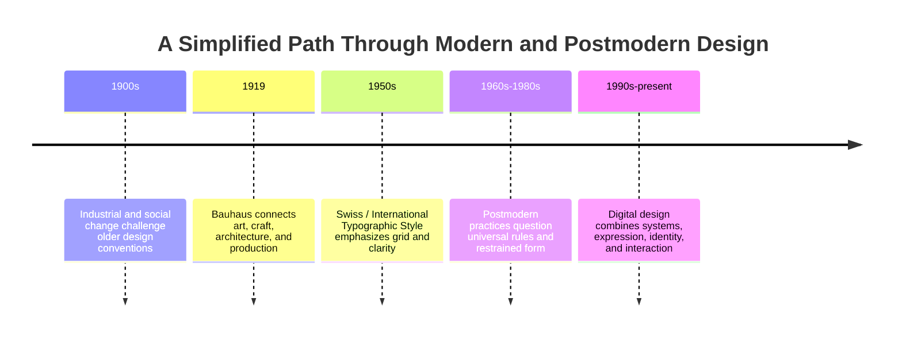

# Chapter 3: Design Language, Modernism, and Postmodernism

Visual design does more than arrange information. It also communicates ideas about order, authority, technology, identity, and everyday life. A grid can make a page feel systematic. An irregular composition can make it feel personal or disruptive. A plain typeface can suggest neutrality, while expressive lettering can call attention to voice and attitude.

These effects are not automatic. People interpret design through experience and cultural context. Still, design traditions give us useful patterns for asking why a visual choice carries a particular meaning.

## A Short Path into Modernism

Modern design developed through several overlapping changes rather than one clean starting point. Industrial production, new technologies, urban growth, mass communication, and social change created a need for visual systems that could work across posters, publications, products, buildings, and information. Designers questioned historical decoration and looked for forms suited to modern life.

The word **modernism** covers many practices, but a common modernist ambition was to make form purposeful. Design should not merely imitate the past or add decoration without reason. It could use structure, materials, geometry, and typography to make an idea clear and useful.

The Bauhaus, founded in Germany in 1919, became an influential site for connecting art, craft, architecture, and industrial production. Its teaching emphasized experimentation with materials and basic visual elements, while its workshops explored how design could operate in everyday life. The school changed locations and eventually closed under political pressure in 1933, but its teaching and networks influenced later design.

The **Swiss Style**, also called the **International Typographic Style**, became especially influential in graphic design during the mid-twentieth century. Designers associated with this approach often used grids, sans-serif type, asymmetrical layouts, photography, and clear information structures. The goal was not that every design look identical; it was that visual decisions should support communication rather than compete with it.

This is a simplified timeline, not a claim that one period replaced another completely. Modernist and postmodern approaches continue to coexist, and designers often combine them.

## Modernist Principles

Modernist design is best understood as a set of recurring questions and methods, not as one fixed appearance.

- **Grid:** A planned structure organizes columns, margins, spacing, and relationships. It can create consistency across many pages or screens.
- **Hierarchy:** Differences in size, weight, position, and spacing show what to notice first, next, and later.
- **Clarity:** Language, images, and layout should help people understand the message without unnecessary obstacles.
- **Reduction:** Removing decoration or visual noise can focus attention on essential information or form.
- **Function:** A design choice should serve a purpose, such as navigation, reading, identification, or use.

A modernist design may feel calm, rational, efficient, or authoritative because its structure suggests that the information has been organized deliberately. Those qualities can help in a transit map or medical form. They can also create distance if the design treats one supposedly neutral standard as suitable for every person and context.

Modernism is not simply "clean design." A sparse page can be confusing, and a decorative page can still be highly usable. Evaluate whether the choices actually help the intended audience.

## Postmodern Reaction and Possibility

Postmodern design developed partly as a reaction against the certainty, restraint, universality, and order associated with modernist design. It questioned whether one rational visual language could represent everyone or whether design could ever be completely neutral. Instead of hiding the act of quotation and construction, postmodern work might make references, contradictions, and visual noise visible.

Common postmodern tendencies include:

- **Plurality:** Allowing multiple styles, histories, identities, and viewpoints to appear together.
- **Irony:** Using a form while also questioning or playfully undermining its usual meaning.
- **Disruption:** Breaking expected order, alignment, sequence, or reading direction.
- **Quotation:** Reusing or transforming recognizable historical, popular, or institutional forms.
- **Expressive typography:** Treating type as image, voice, texture, or attitude as well as a container for words.

Postmodern does not mean random, and modernist does not mean emotionless. A designer can use a grid ironically, or use a dramatic typeface with a clear hierarchy. The value of the distinction is that it helps us notice what a design accepts, questions, or puts into tension.

## Tensions That Continue in Digital Design

The old arguments did not disappear when websites and apps arrived. Digital products still balance competing needs:

| Tension | Modernist emphasis | Postmodern or plural emphasis | Contemporary digital example |
| --- | --- | --- | --- |
| Order and disruption | Stable navigation, repeated components, predictable placement | Unexpected transitions, interruptions, or playful rearrangement | A banking app uses consistent navigation; an editorial site may intentionally interrupt the reading flow with animated type. |
| Universality and identity | A shared system intended to work for many users | Local voice, distinct communities, and visible difference | A design system provides common controls while themes, language, and imagery reflect a specific community. |
| Clarity and expression | Direct labels, readable type, strong information hierarchy | Voice, ambiguity, metaphor, and visual personality | A government form prioritizes plain labels; a music site may let typography respond to an artist's mood. |
| Grid and anti-grid | Columns, spacing tokens, and reusable modules | Overlap, asymmetry, cropping, and intentionally unstable alignment | A commerce page supports scanning with a grid; a campaign page layers text and images to create energy. |
| Restraint and abundance | Limited palette, controlled spacing, and reduction | Dense references, mixed media, and visual excess | A productivity tool reduces distractions; a cultural archive may expose many voices and media types at once. |
| Function and irony | Every element has a clear operational purpose | A familiar interface or symbol is quoted to question expectations | A checkout flow makes action clear; an art project may mimic a checkout flow to comment on consumption. |

These are tendencies, not strict categories. A contemporary interface may use a modernist grid for accessibility and a postmodern visual layer for identity. A designer's responsibility is to make the tradeoff intentional and understandable.

## How to Read a Design

Use the following questions when looking at a poster, product screen, website, package, or garment presentation:

1. **What do I notice first?** Identify the visual hierarchy created by scale, contrast, position, motion, or sound.
2. **What structure organizes the parts?** Look for a grid, repeated modules, a centered axis, a collage, or an anti-grid composition.
3. **What has been removed or added?** Reduction can signal efficiency or seriousness; abundance can signal energy, history, plurality, or excess.
4. **How does typography behave?** Is it quiet and informational, or expressive and image-like? Does it clarify the message or become part of the subject?
5. **What kind of audience is imagined?** Does the design assume a universal user, or does it speak from a specific identity, place, community, or subculture?
6. **What expectations does the design follow or break?** Notice familiar interface patterns, quotations of older styles, irony, and deliberate disruption.
7. **What does the design make easy or difficult?** Meaning matters, but so do reading, navigation, access, and physical or digital use.
8. **What evidence supports my interpretation?** Separate what you can observe from what you are inferring about intention or audience response.

A strong reading can say, "The large headline is noticed first, the asymmetric layout creates tension, and the quotation of a formal notice makes the message feel official," without claiming that every viewer will feel exactly the same thing.

## The Plain White T-Shirt Again

Keep the product identical: the same plain white T-shirt, with the same cut, fabric, price, and purchase terms. Change only the design language around it.

A **modernist presentation** might place the shirt against a plain field with a precise photograph, restrained sans-serif type, a measured grid, and a short list of verified product details. The hierarchy makes fit, material, price, and care information easy to compare. The shirt may feel efficient, dependable, and deliberately reduced: an ordinary object clarified through structure.

A **postmodern presentation** might layer the shirt photograph with contradictory captions, a quotation of a catalog or uniform form, expressive type, irregular cropping, and references to several clothing histories. The layout could ask whether "basic" is natural or culturally constructed. The shirt may feel ironic, self-aware, and open to interpretation: the same object becomes a comment on how products acquire meaning.

Neither presentation changes the shirt's physical qualities. The modernist version emphasizes order and function; the postmodern version emphasizes quotation, identity, and disruption. Both still need accurate information and usable purchase controls.

## Museum Research

Museum and institutional collections are useful because they let you study authentic objects, catalog records, dates, makers, materials, and historical context. Use the institution's own collection search rather than relying only on image results or unsourced social-media posts.

Suggested places to search include The Metropolitan Museum of Art, MoMA, Cooper Hewitt, the V&A, Bauhaus archives, design museums, libraries, and other credible institutional collections. These are research starting points, not a list of objects already selected for this chapter.

Try search terms such as:

- `Bauhaus typography poster`
- `Bauhaus preliminary course design`
- `Swiss Style grid typography`
- `International Typographic Style poster`
- `modernist graphic design sans serif`
- `postmodern graphic design expressive typography`
- `postmodern design collage quotation`
- `design system interface grid typography`

For each result, verify the actual object in the institution's record. Record the title, maker or designer if listed, date, medium, collection, and the words the institution uses to describe it. Do not invent an object, date, attribution, quotation, or link when a search result is unclear. Compare at least one modernist example with one later or postmodern example, then explain which visual choices you can directly observe and which interpretations remain your own.

## What You Should Remember

- Visual design communicates through structure, hierarchy, typography, materials, imagery, and interaction as well as through explicit words.
- Bauhaus and the Swiss / International Typographic Style helped develop influential approaches to purposeful form, systems, grids, and clear communication.
- Postmodern practices questioned universal rules through plurality, irony, disruption, quotation, and expressive typography.
- Modernist and postmodern tendencies continue to mix in contemporary websites, apps, and product experiences.
- The same plain white T-shirt can feel functional and orderly or ironic and culturally self-aware when its surrounding design language changes.
- Read a design by separating observable choices from assumptions about intention, audience, and effect.
- Museum and institutional records can help you verify historical examples before making claims about them.
