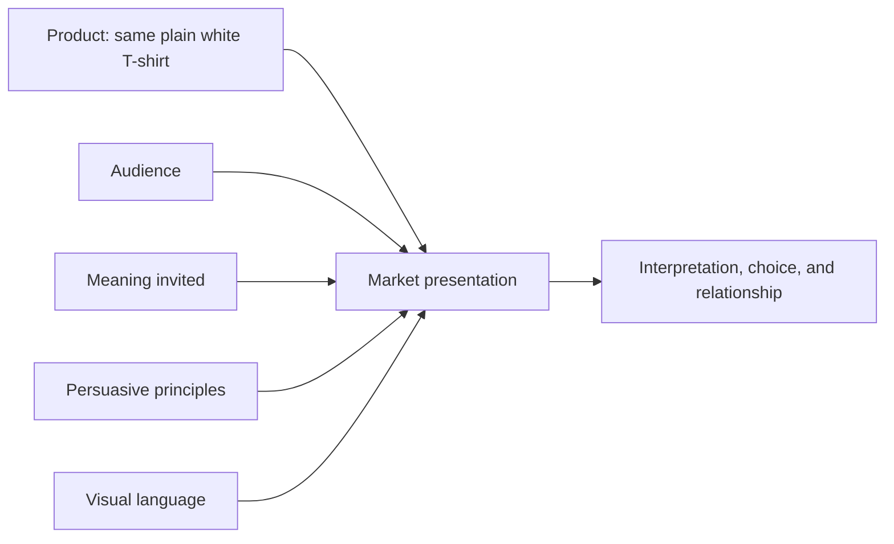

# Chapter 4: One White T-Shirt, Four Different Products

Here is the challenge: sell the same plain white T-shirt four different ways without pretending that the fabric has changed.

Our imaginary product is an ordinary high-quality white T-shirt. It has the same cut, material, sizes, price, care instructions, and purchase terms in every concept. What changes is the meaning built around it: who is addressed, what story is offered, which persuasive cues are used, and how the presentation looks.

This is synthesis in practice. **Persuasion** helps shape attention, interpretation, trust, and action. **Archetypes** give the offer a recognizable role. **Design language** makes that role visible through layout, type, imagery, color, and interaction.

The diagram is a planning model, not a machine that guarantees a response. People may interpret the same presentation differently, and a persuasive cue never replaces truthful product information.

## The Four Concepts at a Glance

| Concept | Target audience | Archetype | Persuasive principles | Visual language | Meaning invited |
| --- | --- | --- | --- | --- | --- |
| Open Road Basic | People who want everyday variety and small adventures | Explorer | Liking, framing, authentic social proof | Documentary photography, open space, practical captions | I am ready to go somewhere new. |
| The Measured Basic | Careful shoppers who compare fit, price, and construction | Sage | Authority, commitment and consistency, clarity | Restrained modernist and Swiss-influenced grid | I make informed, deliberate choices. |
| No Logo, No Apology | People questioning trend cycles and status signals | Rebel | Unity, framing, contrast, ethical scarcity of attention | Disruptive postmodern collage and expressive type | I can reject an expected performance. |
| The Shirt Everyone Knows | People seeking an accessible, dependable everyday staple | Everyperson with Caregiver support | Liking, unity, reciprocity, transparent information | Warm documentary scenes, familiar type, generous spacing | I belong in ordinary life, and ordinary life is enough. |

The table is a comparison tool, not a set of personality diagnoses. A person can belong to more than one audience, and one person can want different meanings in different situations.

## Concept 1: Open Road Basic

### Target Audience

Students, commuters, and weekend walkers who want a versatile everyday shirt and enjoy the possibility of changing plans. The audience is not assumed to be an expert traveler or an athlete. The invitation is to notice the world immediately around them.

### Brand Archetype

**Explorer.** The shirt is framed as a simple companion for movement, curiosity, and self-directed days.

### Persuasive Principles

- **Framing:** Show the shirt as part of an open day rather than as an isolated garment.
- **Liking:** Use a friendly, observant narrator who shares small discoveries without pretending to be a close friend.
- **Authentic social proof:** Include clearly identified, voluntary notes from wearers about where they used the shirt, including limitations such as weather or fit.
- **Action:** Make the size guide and care information easy to find so the adventure story does not hide the buying decision.

### Visual Language

Use documentary-style photographs, open margins, a map-like line that guides the eye, and practical captions. Keep the layout readable, but let images suggest several directions rather than one perfected lifestyle. The palette can include sky blue, leaf green, and the white of the shirt without turning the scene into a fantasy travel advertisement.

### Headline

**"Leave room for the unexpected."**

### Short Product Story

You leave for one ordinary errand and return after taking three unplanned turns. The T-shirt is not presented as equipment that conquers the outdoors. It is a familiar base layer for a day whose shape is still undecided. The product story is about readiness for discovery, not a claim of special performance.

### Likely Imagery

A person wearing the shirt while walking through several everyday environments: a bus stop, a neighborhood street, a public library, and a riverside path. Show the same person and shirt across the sequence so the story remains grounded. Avoid turning an unfamiliar place or another culture into a decorative backdrop.

### Meaning the Customer Is Invited to Buy

The customer is invited to buy a sense of openness: **this ordinary item can leave mental and practical space for my next direction.** The purchase does not make someone adventurous. It gives a familiar object a role in an already possible way of living.

### Ethical Risk or Limitation

The campaign could imply that buying the shirt makes someone brave, mobile, or environmentally responsible. It could also make exploration look available only to people with time, money, or physical access to travel. Use local, varied settings and avoid unsupported claims about durability, sustainability, or performance.

## Concept 2: The Measured Basic

### Target Audience

Careful shoppers who want to compare measurements, materials, care requirements, price, and return terms before deciding. This audience may be buying one shirt to fill a real wardrobe gap, not seeking an emotional transformation.

### Brand Archetype

**Sage.** The presentation treats understanding as part of the product experience.

### Persuasive Principles

- **Authority:** Present relevant, verifiable specifications and explain how measurements were taken.
- **Commitment and consistency:** Let shoppers save a comparison or return to a size decision without turning that action into a promise to buy.
- **Clarity:** Put total price, materials, care, fit notes, and return conditions where they can be compared.
- **Central-route persuasion:** Give people enough useful evidence to evaluate the shirt when fit and construction matter.

### Visual Language

Use a restrained modernist and Swiss-influenced presentation: a measured grid, asymmetrical but stable columns, sans-serif typography, limited color, clear hierarchy, and precise product photography. The layout should feel calm because it is organized, not because it hides complexity. A small diagram can show measurements; it should not replace readable text.

### Headline

**"Know what you are choosing."**

### Short Product Story

The shirt arrives with no mystery campaign attached. Its story is the care taken to make the decision legible: what it is made of, how it fits, how to care for it, what it costs, and what happens if it does not work. The product is positioned as a dependable basic that respects the shopper's attention.

### Likely Imagery

Front, back, and detail photographs on a consistent background; a person wearing the shirt in more than one body size; and a simple measurement diagram. Show natural variation in fit instead of a single idealized body. Keep accessories minimal so the shirt's cut remains inspectable.

### Meaning the Customer Is Invited to Buy

The customer is invited to buy **confidence in a considered choice**. The meaning is not "this shirt will make me intelligent." It is "I can understand this offer well enough to decide for myself."

### Ethical Risk or Limitation

A technical layout can create a false impression of objectivity. Precise numbers do not prove that the shirt is durable, ethical, or right for every body. Do not use the appearance of expertise to bury uncertainty, negative reviews, accessibility information, or alternatives.

## Concept 3: No Logo, No Apology

### Target Audience

People who are tired of status signals, fast-changing trend language, or the expectation that clothing must announce a label. Some may enjoy fashion but want to question the rules that fashion can impose.

### Brand Archetype

**Rebel.** The blank surface of the shirt becomes a prompt to challenge the idea that identity must be displayed through a logo.

### Persuasive Principles

- **Framing:** Present the shirt as an option for opting out of a familiar status performance.
- **Contrast:** Put a blunt statement beside a deliberately ordinary product image.
- **Unity:** Address people who recognize the pressure to signal taste, while making clear that buying this shirt is not a test of membership.
- **Attention:** Use interruption and surprise to make the viewer stop, then provide straightforward product details after the hook.

### Visual Language

Use a disruptive postmodern language: overlapping captions, abrupt scale changes, clipped photographs, quotation marks around official-sounding phrases, and expressive typography that sometimes becomes an image. Mix a plain product photograph with visual references to catalogs, uniforms, and advertisements, but label invented copy as campaign language rather than pretending it is an authentic historical document.

### Headline

**"You do not have to wear the argument."**

### Short Product Story

The shirt is placed in the middle of a loud visual field and refuses to perform. A caption asks whether a basic is ever truly neutral. Another reminds the viewer that a brand selling independence is still selling something. The campaign's self-critique is part of the point: it invites the audience to notice the contradiction instead of hiding it.

### Likely Imagery

A sharply cropped close-up of the blank chest, a hand removing a temporary price sticker, a wall of competing labels with the white shirt interrupting the pattern, and portraits where wearers choose their own styling. Do not imply that people who enjoy logos are shallow or that one purchase proves political resistance.

### Meaning the Customer Is Invited to Buy

The customer is invited to buy **permission to participate selectively**: to choose a garment without treating every trend or label as a command. The shirt is a prop for questioning a social expectation, not a badge that proves the wearer has escaped consumer culture.

### Ethical Risk or Limitation

The campaign can turn refusal into another status signal. It may shame people who enjoy fashion, use rebellion as a sales pressure, or make a political claim the product cannot support. Keep the invitation open, acknowledge the commercial contradiction, and never suggest that buying is required to belong.

## Concept 4: The Shirt Everyone Knows

### Target Audience

People building a practical wardrobe, buying a gift, replacing a worn staple, or looking for clothing that does not demand a special lifestyle. The audience includes different ages, bodies, routines, and budgets.

### Brand Archetype

**Everyperson**, supported by the **Caregiver**. The shirt promises familiarity and support rather than status or transformation.

### Persuasive Principles

- **Liking:** Use a warm, plainspoken tone and recognizable daily situations.
- **Unity:** Show belonging as shared ordinary life, not as loyalty to a narrow in-group.
- **Reciprocity:** Offer a useful care guide whether or not someone buys.
- **Transparent information:** Make price, sizes, accessibility, care, and returns easy to find.

### Visual Language

Use warm documentary photographs, familiar settings, readable type, generous spacing, and a broad range of real routines. The composition can be simple without being sterile. Let the shirt appear in a laundry basket, under a sweater, at a study table, and on a casual visit with friends. Avoid turning "normal" into one body type, household, job, or cultural setting.

### Headline

**"For the days that make up a life."**

### Short Product Story

The shirt does not need a dramatic origin story. It is there for the first coffee, the long class, the messy repair project, the unexpected visit, and the day when nothing special happens. Its value is dependable participation in many kinds of ordinary life.

### Likely Imagery

A sequence of candid-feeling scenes with different wearers using the same shirt in their own ways. Include close details of folding, washing, layering, and repairing. The images should show variety without claiming that a photograph represents everyone.

### Meaning the Customer Is Invited to Buy

The customer is invited to buy **a place in everyday belonging without having to perform a special identity**. The shirt is useful, familiar, and open to personal interpretation.

### Ethical Risk or Limitation

"Everyone" can become an empty claim or conceal who was left out of the design. Do not imply universal fit, universal affordability, or universal comfort without evidence. Show size and accessibility information plainly, and treat the audience as varied rather than interchangeable.

## What the Case Study Shows

The physical shirt stayed substantially the same in all four concepts. The market presentation changed because the surrounding decisions changed:

- The Explorer makes the shirt a companion for possible movement.
- The Sage makes the decision itself the center of the experience.
- The Rebel makes the blank surface a challenge to status signaling.
- The Everyperson makes the shirt a dependable participant in ordinary life.

Persuasion, archetype, and design language reinforce one another, but they are not interchangeable. A grid can support a Sage message, yet a grid alone does not make information truthful. A Rebel headline can attract attention, yet disruption alone does not give the product a meaningful point. An Explorer photograph can suggest possibility, yet it cannot prove performance in conditions the shirt was not designed for.

A good synthesis asks whether the audience, promise, persuasive method, and visual form agree with the actual offer. It also asks where they disagree. Those disagreements are often where ethical risks become visible.

## What You Should Remember

- The same physical product can become several market presentations through changes in audience, meaning, persuasion, and visual language.
- Archetypes offer recognizable invitations such as exploration, expertise, rebellion, or belonging; they do not determine a person's identity.
- Modernist grids can support careful comparison, while postmodern disruption can question familiar meanings. Both require intentional, usable design.
- Persuasive principles should help people understand and evaluate an offer, not hide its limits or pressure them to perform an identity.
- Every product story should be checked against the actual product, the actual audience, and the consequences of the message.
