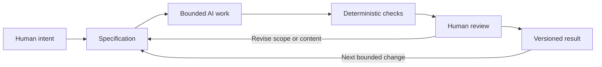

# Chapter 5: From Creative Intent to Reliable Work

A plain white T-shirt can be sold as an invitation to explore, a carefully documented basic, a rebellion against logos, or a dependable part of ordinary life. The shirt stays nearly the same. What changes is the response the presentation tries to enable, the meaning it expresses, and the visual language that makes that meaning recognizable.

Those three lenses form a useful control framework:

- **Persuasion** asks: **What response are we trying to enable?** Do we want someone to notice, understand, compare, trust, participate, or act?
- **Archetype** asks: **What meaning or identity are we expressing?** Is the offer inviting exploration, expertise, belonging, rebellion, care, or another recognizable role?
- **Design language** asks: **How should that meaning look and feel?** Should the presentation use a grid and clear hierarchy, expressive type and disruption, or a deliberate combination?

The lenses are related but not interchangeable. A bold headline may attract attention without creating trust. An Explorer archetype may suggest possibility without proving that a product performs outdoors. A modernist grid may make information easier to scan without making the information true.

## Use the Three Lenses Together

Start with the intended response, then choose the meaning, then decide how the meaning should appear:

1. **Name the response.** What should the audience be able to do or understand after encountering the work?
2. **Name the meaning.** What identity, value, or story should the audience be invited to recognize?
3. **Name the visual behavior.** What should the layout, type, images, color, motion, and interaction make possible?
4. **Check the offer.** Which parts are facts, which are interpretations, and which are invitations? Keep those categories visible.
5. **Test the reading.** Ask whether people can explain what the work means without being handed the intended interpretation.

For the T-shirt, one brief might say: "Help careful shoppers compare an ordinary white shirt." The persuasion goal is informed evaluation. The Sage archetype expresses knowledge and deliberation. A restrained, grid-based presentation supports that meaning. A different brief might ask people to question status signals; the Rebel archetype and a disruptive visual language would create a different invitation.

## Directing AI with the Framework

AI can generate many possible words, layouts, images, plans, and code changes quickly. That speed makes the quality of the direction especially important. A vague request can produce a polished-looking result that solves the wrong problem.

A useful AI brief includes:

- **Purpose:** the response or outcome the work should enable
- **Audience:** whose situation, needs, and context matter
- **Meaning:** the archetypal role or identity the work should express
- **Visual or interaction language:** the structural and expressive choices that fit the meaning
- **Boundaries:** the exact files, scope, format, claims, and exclusions
- **Acceptance criteria:** observable conditions that must be present
- **Verification plan:** which checks will be automated and what a person must inspect

For example, "Write a chapter about a white T-shirt" leaves too much unresolved. "Create one Markdown chapter with four positions for the same imaginary shirt; specify audience, archetype, persuasive principles, visual language, headline, imagery, and ethical limitation for each; include a table and Mermaid diagram" gives the work a bounded shape.

A specification is not a cage for creativity. It is a shared description of the problem that lets creativity operate in the right space. It also gives a reviewer something more useful than a vague feeling: a list of claims to check.

## Four Kinds of Control

### Specification: Decide What Counts as the Task

A specification turns intent into an inspectable request. It states what must be produced, what quality means, and what is outside the task. Bounded work is easier to review, compare, revise, and recover than an open-ended instruction to "make it better."

Good specifications do not need to predict every sentence or implementation detail. They set the purpose, constraints, and evidence of completion while leaving room for appropriate choices.

### Deterministic Checks: Automate the Cheap Repetition

A deterministic check gives the same answer when the relevant input is the same. Examples include:

- confirming that required files exist
- checking links and headings
- validating Markdown or Mermaid syntax
- running tests, type checks, or linters
- scanning for prohibited placeholders or accidental secrets
- checking that a required term or section is present

These checks are useful because they are fast, repeatable, and less tiring than asking a person to count the same conditions repeatedly. They do not establish that a chapter is insightful, a claim is truthful, or a design is culturally appropriate. They check what can be made observable and mechanical.

### Probabilistic Review: Use AI as a Second Reader

AI review can help identify omissions, unclear explanations, inconsistent tone, possible edge cases, or relationships a person may have missed. It can be a useful second reader because it can compare a draft with a specification quickly.

But AI review is probabilistic. It can sound confident while missing a defect, accepting an unsupported claim, or preferring a polished but unsuitable answer. A passing AI review is evidence to consider, not a certificate of truth or quality. Use it alongside deterministic checks and human inspection.

### Human Judgment: Keep Responsibility Where It Belongs

People remain responsible for judgment, meaning, truthfulness, context, accessibility, ethics, and final decisions. A human must decide whether the work actually serves the intended audience, whether the claims are supported, whether the tone is appropriate, and whether an apparently successful result creates an unacceptable risk.

This is especially important when work involves identity, culture, persuasion, safety, private information, or consequences for other people. A checklist can show that a section exists. It cannot decide whether the section treats its subject with care.

## The Pit-Stop Principle

Think of an AI-assisted workflow as a race car during a long event. Automation can keep running around the track: checking files, running tests, comparing requirements, and reporting repeatable results. Human review is the pit stop. The car does not stop for every meter of the race, but selected moments deserve deliberate inspection before it returns to action.

At the pit stop, a person can ask:

- Is this still the problem we meant to solve?
- Does the result make meaning clear without manipulating the audience?
- Are facts, examples, and citations - or the absence of citations - handled honestly?
- Does the work fit the cultural and practical context?
- What should be revised before this version is shared or merged?

The metaphor is not an excuse to inspect only at the end. A human should choose sensible review points based on risk: after a first draft, after a major change, before publication, and whenever a check reports something surprising.

## Why Version Control Matters

When AI generates work, many drafts and edits can appear quickly. Git provides a record of what changed, when it changed, and which version was reviewed. A branch can isolate one bounded task. A commit can describe a meaningful result. A diff can make the actual changes visible. A prior version can be recovered if a new edit introduces a problem.

This traceability supports learning as well as safety. A student can compare an initial AI draft with an edited version and ask which decisions improved it. A team can see whether a change addressed the specification or drifted into an unrelated redesign. A reviewer can inspect the work rather than trusting a summary of what supposedly happened.

Version control does not make a decision correct. It makes the decision and its history easier to inspect, discuss, and undo.

The loop matters. Review can send work back to the specification when the problem was unclear, to the draft when the execution was weak, or to the checks when a requirement was not made observable.

## Questions for Next Week

1. What is one task you could make smaller and more inspectable before asking an AI assistant to do it?
2. Which parts of your next task can be checked deterministically, and which require human judgment?
3. What audience, cultural, or ethical context could an AI assistant miss?
4. Which meaning or identity is your work expressing, and what evidence supports that interpretation?
5. Where should a deliberate human pit stop occur before the result is published or merged?
6. What would you want Git to help you recover if the next revision went in the wrong direction?

## What You Should Remember

- Persuasion identifies the response a work is trying to enable, archetype identifies the meaning or identity it expresses, and design language shapes how that meaning looks and feels.
- A clear specification gives AI-assisted work a bounded purpose, scope, and definition of completion.
- Deterministic checks handle cheap, repeatable validation; AI review can broaden inspection but remains probabilistic.
- Humans remain responsible for judgment, truthfulness, context, ethics, and final decisions.
- Git provides traceability, comparison, and recovery when generated work changes quickly.
- Treat human review like a race-car pit stop: keep automation moving, but stop deliberately at moments where meaning and consequences need inspection.
